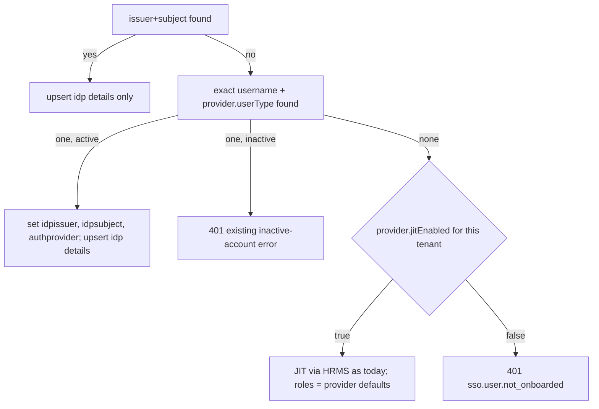
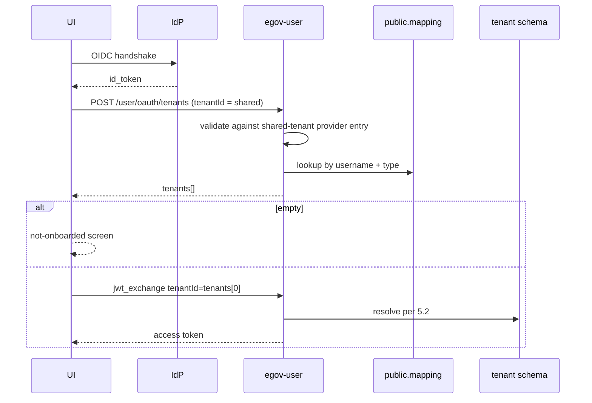

# Shared-Tenant SSO Login — Design

| | |
|---|---|
| **Status** | Proposed, 2026-09-22 |
| **Client** | WHO AFRO HCM deployment |
| **Scope** | `egov-user` only. UI, gateway, HRMS unchanged |
| **Supersedes** | `IDP-MULTI-TENANT-LOGIN-*.md` (2026-09-18) |
| **Background** | `OIDC-SSO-REFERENCE.md` — current `jwt_exchange` implementation |
| **Decisions** | §13 |

---

## 1. Problem

One login page serves every tenant. After the person authenticates at the identity provider (IdP), `egov-user` must answer "which tenants may this person enter" without a tenant in the request. Today:

- Users live in per-tenant schemas. No cross-tenant lookup exists.
- `jwt_exchange` requires a caller-supplied `tenantId` and trusts it.
- A pre-provisioned employee (HRMS or upload) has no IdP subject stored, so first SSO login creates a duplicate.
- SSO login overwrites roles from token claims.

## 2. Requirements

| # | Requirement | Source |
|---|---|---|
| R1 | Shared page: authenticate first, then list the person's tenants (possibly empty) | client |
| R2 | UI enters the first tenant; in-app switching is UI work, out of scope | client |
| R3 | Unknown user: create-if-missing is configurable per tenant | client |
| R4 | Password login remains on the same page | client |
| R5 | Provider-agnostic OIDC | client |
| R6 | Existing users: roles never change at login | client |
| R7 | No backfill of existing users | client |

## 3. Architecture

```mermaid
flowchart LR
    UI[Shared login page] -->|1 OIDC handshake| IdP
    UI -->|2 POST /user/oauth/tenants + id_token + shared tenantId| T[TenantLookupController]
    T --> V[JwtValidationService, tenantId = shared tenant]
    T --> M[(public.eg_user_tenant_mapping)]
    UI -->|3 jwt_exchange + tenants[0]| X[JwtExchangeAuthenticationProvider]
    X --> L[issuer+subject → username → JIT]
    X --> U[(tenant schema eg_user)]
    C[UserRepository.create / update] -->|same txn| M
```

- One new read endpoint, one new public table, two write hooks, one linking change in the exchange.
- Feature flag: existing `auth.oidc.enabled`.
- New property `auth.oidc.shared-login.tenant-id` (env `AUTH_OIDC_SHARED_LOGIN_TENANT_ID`), e.g. `who`. The tenants endpoint accepts only this tenant id.

## 4. Data model

`public.eg_user_tenant_mapping`

| Column | Type | Note |
|---|---|---|
| `userid` | bigint | `eg_user.id` in that tenant |
| `type` | varchar(50) | `EMPLOYEE` / `CITIZEN` |
| `tenantid` | varchar(256) | full tenant id, e.g. `who.chad` |
| `usernamekey` | varchar(512) | plaintext username encrypted with the **shared login tenant's** key (enc-service `Normal`, deterministic) |
| `uuid` | varchar(36) | tracing |
| `active` | boolean | mirrors `eg_user.active` |
| `createddate`, `lastmodifieddate` | timestamp | |

- PK `(userid, type, tenantid)`. Partial index `(usernamekey, type) WHERE active`.
- Why a derived key: `eg_user.username` is encrypted per tenant (MDMS `DataSecurity.SecurityPolicy`, model `User`), so ciphertexts differ across tenants and plaintext may not be stored in a public table. Encrypting with one fixed tenant (`auth.oidc.shared-login.tenant-id`) yields a single cross-tenant lookup value while keeping the username encrypted at rest. Same mechanism egov-user already uses to search by username. The shared tenant must therefore exist in the enc-service tenant list (MDMS `tenant.tenants`).
- Row lifecycle keyed by `userid`, so the update hook needs no plaintext:
- Migration lives apart from the per-tenant `ddl` set: `db/migration/public/V20260922080000__create_eg_user_tenant_mapping.sql`, `public.`-qualified, `CREATE TABLE IF NOT EXISTS`, `CREATE INDEX IF NOT EXISTS`. The `db-migration` job runs this folder once against `public`, not once per tenant schema. `flyway.locations` in `application.properties` is unchanged; the Dockerfile copies the folder to `/flyway/public` and the migrate script runs it as a separate step.
- Row lifecycle

| Event | Action |
|---|---|
| `UserService.createUser` | derive `usernamekey` from the plaintext username before encryption; `UserRepository.create` upserts the row with `active` = user's flag |
| `UserRepository.update`, `active` flips | `UPDATE … SET active` by `(userid, type, tenantid)` |
| shared tenant not configured | key is null; no row written (feature inactive) |
| username change | not possible on update; no re-key |

- No backfill (R7). Existing employees appear only after a create/update path runs for them, or after they sign in through a tenant URL.

## 5. API

### 5.1 `POST /user/oauth/tenants` (new)

| Item | Value |
|---|---|
| Auth | Basic client id, validated against the existing in-memory `ClientDetailsService` by `ClientBasicAuthFilter` mapped to this path only |
| Content type | `application/x-www-form-urlencoded` |
| Body | `assertion=<id_token>&tenantId=<shared tenant>` |
| Tenant rule | `tenantId` required; must equal `auth.oidc.shared-login.tenant-id`, else `400 sso.param.tenant_not_shared`. Keeps the every-API-carries-a-tenant convention and sets the tenant MDC in central instance |
| Success | `200` `{"username":"a@who.int","tenants":[{"tenantId":"who.chad","userId":101,"uuid":"…"}]}` sorted by `tenantId` |
| Empty | `200` with `"tenants":[]` |
| Disabled | `404` when `auth.oidc.enabled=false` |

Steps

1. `JwtValidationService.validate(token, sharedTenantId)` — provider resolution filters on `tenantId = shared tenant`, so the MDMS `IdentityProviders` master needs one entry whose `tenantId` is the shared tenant (issuer, JWKS, audiences, `usernameClaimKey`). `jitEnabled` is meaningless on that entry.
2. Read `provider.usernameClaimKey` (default `preferred_username`); missing claim → `401 sso.param.username_claim_missing`.
3. `usernamekey = encryptValue(claim, sharedTenant, "Normal")`; `SELECT tenantid, userid, uuid FROM public.eg_user_tenant_mapping WHERE usernamekey=? AND type=? AND active ORDER BY tenantid`.
4. No replay record written; the same `id_token` is expected at the next exchange.

Errors reuse `SsoErrorCodes`; status comes from each `SsoException` (`sso.jwt.*` → `401`, `sso.param.*` → `400`, `sso.oidc.provider_not_found` → `500`, matching the token endpoint).

### 5.2 `POST /user/oauth/token` `grant_type=jwt_exchange` (changed)

Resolution inside the requested tenant:



- Username lookup: `UserService.getUniqueUser(userName, tenantId, userType)`, exact match as today.
- `createUserForSsoUpdate` no longer sets `roles`; the `rolesChanged` branch is removed (R6).
- Everything else (replay check, MFA, eligibility, token issuance) unchanged.

### 5.3 MDMS `SSO.IdentityProviders` entry — new fields

| Field | Default | Meaning |
|---|---|---|
| `usernameClaimKey` | `preferred_username` | claim compared with `eg_user.username` |
| `jitEnabled` | `false` | create-if-missing for this provider+tenant |

Parsed in `MdmsOidcProviderSupplier.mapNodeToProvider`, carried on `AuthProperties.Provider`.

## 6. Flows

### 6.1 Shared-page login



### 6.2 Tenant-URL login

Unchanged: UI calls `jwt_exchange` with the tenant from the URL. Resolution per 5.2 applies, so linking and JIT policy are identical on both pages.

### 6.3 Deactivation

`updateWithoutOtpValidation` with `active=false` → `UserRepository.update` deletes the mapping row in the same transaction. The next tenants call omits that tenant.

## 7. Components

| Component | File | Change |
|---|---|---|
| Migration | `db/migration/ddl/V…__create_public_eg_user_tenant_mapping.sql` | new |
| Repository | `persistence/repository/UserTenantMappingRepository.java` | new; upsert, setActive, findActiveByUsernameKeyAndType; `public.`-qualified SQL, no `{schema}` |
| Key derivation | `domain/service/utils/EncryptionDecryptionUtil.tenantMappingKey` | encrypt plaintext username with shared tenant; null when unconfigured |
| Create hook | `domain/service/UserService.createUser` + `UserRepository.create` | key derived pre-encryption, carried on transient `User.tenantMappingKey`, row upserted after `save()` |
| Update hook | `persistence/repository/UserRepository.java` `update` | `setActive` on `active` flip |
| Controller | `web/controller/TenantLookupController.java` | new |
| Service | `domain/service/TenantLookupService.java` | new; steps in 5.1 |
| Filter | `security/ClientBasicAuthFilter.java` | new; registered for `/oauth/tenants` |
| Config | `config/AuthProperties.java` `Oidc.sharedLoginTenantId`, `application.properties` `auth.oidc.shared-login.tenant-id` | new |
| Migration job | `Dockerfile`, `build/…/migrate.sh` | copy and run `db/migration/public` once |
| Exchange | `security/oauth2/custom/jwt/JwtExchangeAuthenticationProvider.java` | username fallback, JIT gate, drop role write |
| Provider model | `config/AuthProperties.java`, `config/OidcConfigConstants.java`, `config/MdmsOidcProviderSupplier.java`, `config/StaticOidcProviderSupplier.java` | two fields |
| Errors | `security/oauth2/custom/jwt/SsoErrorCodes.java` | `sso.user.not_onboarded`, `sso.param.username_claim_missing`, `sso.param.tenant_not_shared` |
| Contract | `web/contract/auth/TenantLookupResponse.java` | new |

## 8. Errors and edge cases

| Case | Behaviour |
|---|---|
| `tenantId` missing or not the shared tenant | `400 sso.param.tenant_not_shared` |
| No provider entry for the shared tenant (unknown issuer) | `500 sso.oidc.provider_not_found`, unchanged from the token endpoint; a provider-configuration error, not a credential error |
| Username claim missing | `401 sso.param.username_claim_missing` |
| Mapping row present, user row gone | exchange `401 sso.user.not_onboarded`; row cleared on next update path |
| Public table missing | user create/update fails; migration is a deployment prerequisite |
| Non-central deployment | identical; table is `public.` either way |
| Unknown Basic client | `401` from filter |
| Clock skew | unchanged; validator tolerance applies |

## 9. Security

- The tenants endpoint reveals tenant membership only to a holder of a valid, unexpired, signature-checked `id_token` for that identity plus the registered client id. Enumeration of other users is not possible from the endpoint.
- The OAuth client has no secret configured today; the filter checks client id existence, matching the token endpoint's effective posture. Adding a secret is a separate change.
- No new token material is stored. Replay protection stays on the exchange.
- The mapping table never holds plaintext usernames; `usernamekey` is enc-service ciphertext under the shared tenant key. Rotating that key (`_rotateallkeys`) invalidates lookups exactly as it does for existing username search; re-derive keys after rotation.
- Username linking binds an IdP subject to a pre-provisioned user on first login. It runs only when the user has no IdP subject yet; a user already linked to a different subject is rejected with `sso.user.not_onboarded`. The configured `usernameClaimKey` must be a claim the IdP guarantees unique and non-reassignable for that provider; `preferred_username` in Entra ID meets this, free-text claims do not.
- `SsoCacheAdminController` remains unauthenticated at the application layer; unchanged by this design, tracked in `OIDC-SSO-LOGIN.md` §8.

## 10. Test plan

Unit (JUnit 4, Mockito)

| Class | Cases |
|---|---|
| `UserTenantMappingRepositoryTest` | insert, delete, lookup sorted, unknown → empty |
| `UserRepositoryTest` | create active writes row; create inactive skips; update flips insert/delete; no-op when unchanged |
| `TenantLookupServiceTest` | shared-tenant provider resolution; wrong or missing `tenantId`; claim key default and override; missing claim; type filter; disabled flag |
| `JwtExchangeAuthenticationProviderTest` | subject hit; username link stores subject; inactive rejected; JIT on/off; roles untouched |
| `ClientBasicAuthFilterTest` | missing, unknown, valid |

e2e (`egov-user/e2e`, tenants `bo`/`oy`, mock OIDC issuer container)

| # | Scenario | Expect |
|---|---|---|
| T1 | user in `bo` only | `[bo]` |
| T2 | user in `bo` and `oy` | `[bo, oy]` |
| T3 | unknown user | `[]` |
| T4 | deactivated in `bo` | `bo` absent |
| T5 | pre-provisioned password user, first SSO | linked, no duplicate, roles unchanged |
| T6 | JIT off, unknown user, exchange | `401 sso.user.not_onboarded` |
| T7 | JIT on, unknown user, exchange | user + mapping row created |
| T8 | same `id_token`: tenants then exchange, then exchange again | ok, ok, replay `401` |
| T9 | bad Basic client | `401` |
| T10 | `auth.oidc.enabled=false` | `404` |
| T11 | `tenantId=bo` on tenants endpoint (shared is `who`) | `400 sso.param.tenant_not_shared` |

## 11. Rollout

1. Run the `db/migration/public` step once; verify `public.eg_user_tenant_mapping` exists before traffic. Per-tenant `ddl` runs are unaffected.
2. Set `AUTH_OIDC_SHARED_LOGIN_TENANT_ID` (e.g. `who`) on the deployment.
3. Add an `IdentityProviders` entry with `tenantId` = shared tenant; add `usernameClaimKey` and `jitEnabled` to each per-tenant entry.
4. Gateway: expose `/user/oauth/tenants` as an open endpoint alongside `/user/oauth/token` (outside this repo).
5. Communicate R7: existing staff use tenant URLs or are re-saved until rows exist.

## 12. Open items

| # | Item | Owner |
|---|---|---|
| 1 | Confirm `preferred_username` equals `eg_user.username` for AFRO's provider; else set `usernameClaimKey` | client |
| 2 | Decide whether a backfill is wanted later; `INSERT … SELECT` per tenant schema is a one-file follow-up | PO |
| 3 | OAuth client secret | security |
| 4 | Key rotation procedure for the shared tenant: re-derive `usernamekey` for all rows | ops |

## 13. Decision records

Decisions with the options rejected and why. Numbering matches the former ADR files.

### 13.1 User–tenant mapping in the public schema keyed by shared-tenant-encrypted username


**Decision**

Add `public.eg_user_tenant_mapping(userid, type, tenantid, usernamekey, uuid, active)` keyed `(userid, type, tenantid)`. `usernamekey` is the plaintext username encrypted with the shared login tenant's enc-service key (deterministic `Normal` type), derived in `UserService.createUser` before the user object is encrypted. `active` follows `eg_user.active` via `UserRepository.update`. No backfill.

**Amended 2026-09-22:** the first cut keyed rows by `eg_user.username`. e2e showed that column is encrypted per tenant (SecurityPolicy model `User`), so no cross-tenant match was possible.

**Options considered**

| Option | Rejected because |
|---|---|
| Fan-out query across every tenant schema at login | O(tenants) per login; schema list is not known to the service |
| Key on IdP issuer+subject | pre-provisioned users have no subject until first login; they would never be listed |
| Normalised (lower-cased) username | `eg_user` is case-sensitive; two users could collide in the mapping. Client chose exact match |
| Plaintext username in the public table | violates the data-security policy that encrypts `username` |
| HMAC with a service secret | rotation-proof, but a new secret to manage and not auditable; enc-service is already the mechanism for username search |
| Delete row on deactivate | update hook only sees ciphertext; keying by `userid` with an `active` flag avoids any decrypt |
| Kafka event + persister | eventual consistency at login; extra topic and yml for a one-table write |
| Backfill migration | client chose to rely on create/update paths only |

**Consequences**

- User create and update now depend on the public table; migration must precede traffic.
- The migration sits in a separate `db/migration/public` folder run once against `public`, not in the per-tenant `ddl` set.
- Deactivation flips `active=false`; reactivation flips it back. Lookup filters `active`.
- The shared tenant must exist in the enc-service tenant list so a key exists for it.
- Rotating the shared tenant's key invalidates all `usernamekey` values until re-derived.
- Existing employees are invisible on the shared page until a create/update path runs for them.

### 13.2 Separate tenants endpoint before the token exchange


**Decision**

New `POST /user/oauth/tenants` accepts an `id_token` and a `tenantId` that must equal the configured shared login tenant (`auth.oidc.shared-login.tenant-id`), validates the token against that tenant's provider entry, and returns the mapping rows. The UI then calls the existing `jwt_exchange` with the first tenant. The endpoint requires the registered OAuth client id via Basic auth and records no replay state.

**Options considered**

| Option | Rejected because |
|---|---|
| Make `tenantId` optional on `jwt_exchange`, auto-pick first tenant | conflates listing with session issuance; token response shape cannot carry the list cleanly; couples UI switcher to the token endpoint |
| Second custom grant type on `/oauth/token` | client auth for free, but response must fit `OAuth2AccessToken` |
| Open endpoint, `id_token` only | loses the client check the token endpoint applies |
| No `tenantId` on the request | breaks the every-API-carries-a-tenant convention; no tenant MDC; provider resolution would rely on audience alone |

**Consequences**

- Two round-trips on the shared page; one on tenant URLs.
- The same `id_token` must remain valid across both calls, so the lookup writes nothing to `eg_user_idp_details`.
- Gateway must whitelist the new path.
- MDMS needs one `IdentityProviders` entry whose `tenantId` is the shared tenant.
- Client id check mirrors the token endpoint; no secret exists today (`AuthorizationServerConfiguration` registers none).

### 13.3 Per-tenant JIT flag and no role writes at login


**Decision**

- `jitEnabled` on the MDMS `SSO.IdentityProviders` entry (already scoped per tenant) gates create-if-missing. Default `false`.
- Exchange resolution order: issuer+subject → exact username → JIT if enabled → `sso.user.not_onboarded`.
- Login never modifies roles of an existing user. JIT-created users receive provider defaults only.
- `usernameClaimKey` on the same entry names the claim compared with `eg_user.username`. Default `preferred_username`.

**Options considered**

| Option | Rejected because |
|---|---|
| New MDMS master for login policy | second master for two fields |
| Properties allow-list | redeploy to change; not per tenant in central instance |
| Keep role refresh on every login | client requires roles to be owned by DIGIT admin, not the token |
| Require IdP subject at ingestion | ingestion sources do not know it |

**Consequences**

- Removing `roles` from `createUserForSsoUpdate` deletes the `rolesChanged` branch.
- A pre-provisioned user is linked once; later logins hit the subject path.
- Shared page cannot JIT because no tenant is known; empty list is the answer.
