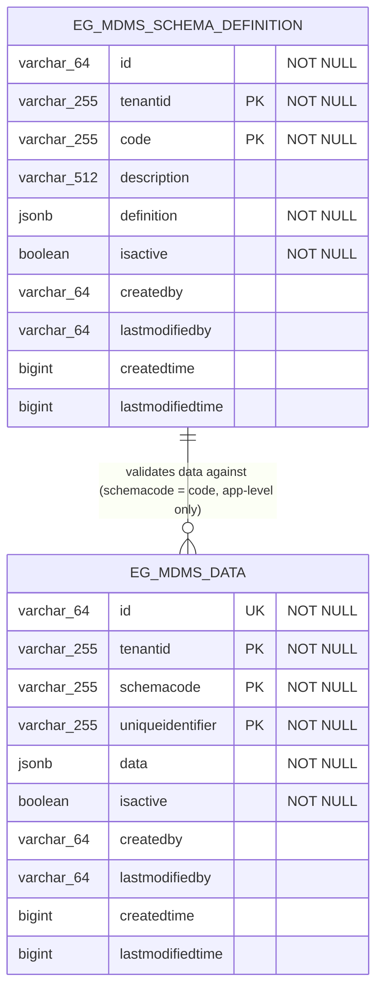

# Master Data Management service

Master Data Management Service is a core service that is made available on the DIGIT platform.  It encapsulates the functionality surrounding Master Data Management.  The service fetches Master Data pertaining to different modules. The functionality is exposed via REST API.

### DB UML Diagram

MDMS V2 persists to two Postgres tables (see `src/main/resources/db/migration/main/`). There is no enforced foreign key between them - `eg_mdms_data.schemacode` is only logically validated against `eg_mdms_schema_definition.code` at the application layer (schema validation on create/update), not via a DB constraint.



- `eg_mdms_schema_definition` - one row per registered JSON schema, keyed by `(tenantid, code)`. `definition` holds the JSON schema used to validate master data.
- `eg_mdms_data` - one row per master data record, keyed by `(tenantid, schemacode, uniqueidentifier)`, with a separate unique `id` (UUID) used as the external identifier in `/v2/_update/{schemaCode}` requests. `data` holds the actual master data payload.

### Service Dependencies
- NA

### Swagger API Contract

Please refer to the  below Swagger API contarct for MDMS service to understand the structure of APIs and to have visualization of all internal APIs.
http://editor.swagger.io/?url=https://raw.githubusercontent.com/egovernments/egov-services/master/docs/mdms/contract/v1-0-0.yml#!/

For the MDMS V2 APIs (schema `/mdms-v2/schema/v1/_create`, `_search`, `_update` and master data `/mdms-v2/v2/_search`, `_count`, `_create`, `_update`), refer to the contract checked into this repo:
[`core-services/docs/mdms-v2-contract.yml`](../docs/mdms-v2-contract.yml). It can be pasted into http://editor.swagger.io/ for a visual walkthrough of the requests/responses.


## Service Details

The MDM service reads the data from a set of JSON files from a pre-specified location. It can either be an online location (readable JSON files from online) or offline (JSON files stored in local memory). The JSON files should conform to a  prescribed format. The data is stored in a map and tenantID of the file serves as a key. 
Once the data is stored in the map the same can be retrieved by making an API request to the MDM service. Filters can be applied in the request to retrieve data based on the existing fields of JSON.

#### Master data management files check in location and details -

1. Data folder parallel to docs (https://github.com/egovernments/egov-mdms-data/tree/master/data/pb). 
2. Under data folder there will be a folder `<state>` which is a state specific master folder.
3. Under `<state>` folder there will `<tenant>` folders where ulb specific master data will be checked in. for example `pb.testing`
4. Each module will have one file each for statewise and ulb wise master data. Keep the file name as module name itself.

### Sample Config

Each master has three key parameters `tenantId`, `moduleName`, `masterName`. A sample master would look like below

```json
{
  "tenantId": "pb",
  "moduleName": "common-masters",
  "OwnerType": [
    {
      "code": "FREEDOMFIGHTER",
      "active": true
    },
    {
      "code": "WIDOW",
      "active": true
    },
    {
      "code": "HANDICAPPED",
      "active": true
    }
  ]
}
```
Suppose there are huge data to be store in one config file, the data can be store in seperate files. And these seperated config file data can be use under one master name, if `isMergeAllowed`
flag is `true` in [mdms-masters-config.json](https://raw.githubusercontent.com/egovernments/punjab-mdms-data/UAT/mdms-masters-config.json)
### API Details

`BasePath` /mdms/v1/[API endpoint]

##### Method
a) `POST /_search`

This method fetches a list of masters for a specified module and tenantId.
- `MDMSCriteriaReq (mdms request)` : Request Info + MdmsCriteria — Details of module and master which need to be searched using MDMS.

- `MdmsCriteria`

    | Input Field                               | Description                                                       | Mandatory  |   Data Type      |
    | ----------------------------------------- | ------------------------------------------------------------------| -----------|------------------|
    | `tenantId`                                | Unique id for a tenant.                                           | Yes        | String           |
    | `moduleDetails`                           | module for which master data is required                          | Yes        | String           |

- `MdmsResponse`  Response Info + Mdms

- `Mdms`

    | Input Field                               | Description                                                       | Mandatory  |   Data Type      |
    | ----------------------------------------- | ------------------------------------------------------------------| -----------|------------------|
    | `mdms`                                    | Array of modules                                                  | Yes        | String           |

### MDMS V2 API Details

`BasePath` /mdms-v2/v2/[API endpoint]

Full contract: [`core-services/docs/mdms-v2-contract.yml`](../docs/mdms-v2-contract.yml)

##### Method
a) `POST /_search`

Fetches master data matching a `MdmsCriteria` (with tenant-level fallback and offset/limit pagination). Request: `MdmsCriteriaReqV2` (RequestInfo + MdmsCriteria). Response: `MdmsResponseV2` (ResponseInfo + list of `mdms`).

b) `POST /_count`

Returns the total number of master data records matching a `MdmsCriteria`, without fetching the records. It accepts **the exact same request contract as `/_search`** (`MdmsCriteriaReqV2`/`MdmsCriteria`) — offset/limit are ignored — and resolves the tenant-fallback chain identically to `/_search`, so the returned `totalCount` always corresponds to the same tenant tier that `/_search` would return data from for the same criteria.

- `MdmsCriteriaReqV2` : RequestInfo + MdmsCriteria (same model used by `/_search`)

- `MdmsCriteria`

    | Input Field                               | Description                                                                    | Mandatory  |   Data Type            |
    | ----------------------------------------- | -------------------------------------------------------------------------------| -----------|------------------------|
    | `tenantId`                                | Unique id for a tenant. Falls back to parent tenants if no match is found.     | Yes        | String                 |
    | `ids`                                     | List of master data ids to filter by.                                          | No         | Set of String          |
    | `uniqueIdentifiers`                       | List of business unique identifiers to filter by.                              | No         | Set of String          |
    | `schemaCode`                              | Schema code to filter master data by.                                          | No         | String                 |
    | `filters`                                 | Key-value filters applied against the JSON data payload.                       | No         | Map of String to String|
    | `isActive`                                | Filter master data by active/inactive status.                                  | No         | Boolean                |
    | `offset`                                  | Number of records to skip. Ignored by `/_count`.                               | No         | Integer                |
    | `limit`                                   | Maximum number of records to return. Ignored by `/_count`.                     | No         | Integer                |

- `MdmsCountResponseV2` : ResponseInfo + totalCount

    | Input Field                               | Description                                                       | Mandatory  |   Data Type      |
    | ----------------------------------------- | ------------------------------------------------------------------| -----------|------------------|
    | `totalCount`                              | Total number of master data records matching the given criteria.  | Yes        | Long             |

c) `POST /_create/{schemaCode}`

Creates a new master data record, validated against the JSON schema identified by `schemaCode`. Request/Response: `MdmsRequest` / `MdmsResponseV2`.

d) `POST /_update/{schemaCode}`

Updates an existing master data record, re-validated against the JSON schema identified by `schemaCode`. Request/Response: `MdmsRequest` / `MdmsResponseV2`.

### Kafka Consumers

- NA

### Kafka Producers

- NA