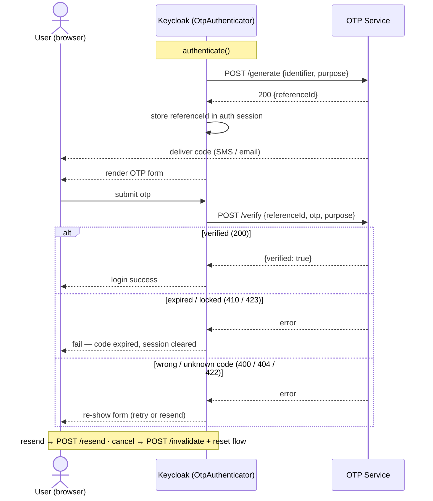
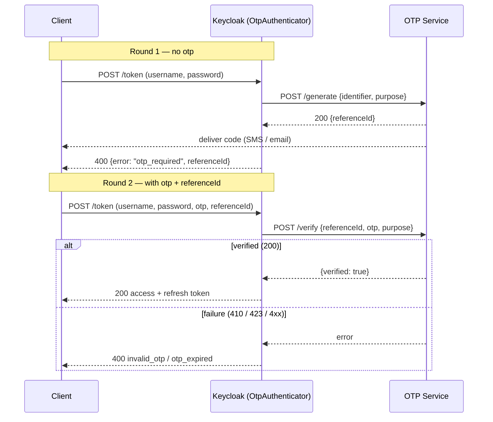

# Keycloak OTP Service Authenticator

A Keycloak [Authenticator SPI](https://www.keycloak.org/docs/latest/server_development/#_auth_spi)
that adds a one-time-password step to a login flow. It does **not** generate or
deliver codes itself — it delegates to an external **OTP microservice** (v3) over
HTTP. Keycloak owns the user, the session, and the login UI; the OTP service owns
code generation, delivery (SMS/email), expiry, rate-limiting, and verification.

It registers two authenticators that share one implementation:

| Display name | Provider ID | Destination |
|---|---|---|
| **OTP – Email** | `otp-email-authenticator` | user's email |
| **OTP – SMS** | `otp-sms-authenticator` | user's `mobileNumber` attribute |

---

## What it does

During a login flow, after the user is identified, the authenticator:

1. **Generates** an OTP — sends the user's destination (`identifier`) + `purpose`
   to the OTP service, which delivers the code out-of-band and returns a
   `referenceId`.
2. **Prompts** the user for the code (browser form) or signals the client to retry
   with the code (direct grant).
3. **Verifies** the entered code against the `referenceId`, and on success lets the
   login proceed.

It supports **resend** and **cancel**, and works in both the **browser flow** and
the **direct-grant (ROPC) flow**.

---

## How it works

### Architecture

```
EmailOtpAuthenticatorFactory ─┐
                              ├─► OtpAuthenticator ──► OtpClient ──HTTP──► OTP service (v3)
SmsOtpAuthenticatorFactory  ──┘     (channel-agnostic)   (JDK HttpClient)
```

- **`OtpAuthenticator`** is channel-agnostic — it contains all the flow logic and
  knows nothing about email vs SMS.
- The two **factories** inject the only things that differ per channel: which user
  attribute holds the destination, and the OTP `purpose`.
- Everything (`OtpConfig`, the HTTP client, `OtpClient`, the authenticator) is built
  **once at server startup** and reused. The authenticator is **stateless and
  thread-safe** — all per-login state lives in the Keycloak auth session, so a single
  shared instance safely serves concurrent logins.

### Service contract (v3)

All calls are `POST {OTP_HOST}{path}` with headers `X-Tenant-Id: <realm name>` and a
generated `X-Request-Id`. Errors come back as a JSON array `[{ "code", "message", … }]`.

| Operation | Endpoint (default) | Request | Response |
|---|---|---|---|
| Generate | `/otp/v3/generate` | `{identifier, purpose}` | `{referenceId, expiresIn, cooldownSeconds}` |
| Resend | `/otp/v3/resend` | `{referenceId}` | `{referenceId, expiresIn, cooldownSeconds, purpose}` |
| Verify | `/otp/v3/verify` | `{referenceId, purpose, otp}` | `{verified, purpose}` |
| Invalidate | `/otp/v3/invalidate` | `{referenceId}` | `{invalidated, purpose}` |

The `identifier` is the raw email/phone; the service infers the type. `verify` requires
the **same `purpose`** the code was generated with.

### Verify outcome mapping

Verification success is HTTP `200` with `verified=true`. Failures arrive as HTTP
statuses and are mapped to Keycloak flow outcomes:

| HTTP | Meaning | Behaviour |
|---|---|---|
| `200` + `verified` | OK | login proceeds |
| `410` / `423` | expired / locked | terminal failure, session cleared |
| `400` / `404` / `422` | bad/unknown/wrong code | retryable — session kept so user can re-enter or resend |
| other | service error | internal error |

### Browser flow

`generate → render OTP form → verify`. The `referenceId` is held in the Keycloak auth
session (the login cookie provides continuity); the user never sees it. The form
supports **resend** and **cancel** (which invalidates the OTP and resets the flow).



### Direct grant (ROPC, `grant_type=password`) — two round-trips

There's no session continuity between token calls, so the client carries the
`referenceId`:

- **Round 1** (no `otp`): generate an OTP, respond `400 {"error":"otp_required","referenceId":"…"}`.
- **Round 2** (`otp` + `referenceId`): verify → `200` token, or a JSON error
  (`invalid_otp` / `otp_expired` / `server_error`).



---

## Configuration

All configuration is via **environment variables**, read once at startup. No Keycloak
Admin-UI config — the factory already knows its channel.

| Variable | Default | Description |
|---|---|---|
| `OTP_HOST` | `http://localhost:8081` | OTP service base URL |
| `OTP_GENERATE_PATH` | `/otp/v3/generate` | generate endpoint path |
| `OTP_RESEND_PATH` | `/otp/v3/resend` | resend endpoint path |
| `OTP_VERIFY_PATH` | `/otp/v3/verify` | verify endpoint path |
| `OTP_INVALIDATE_PATH` | `/otp/v3/invalidate` | invalidate endpoint path |
| `OTP_EMAIL_PURPOSE` | `login` | purpose sent for the email channel |
| `OTP_SMS_PURPOSE` | `login` | purpose sent for the SMS channel |
| `KEYCLOAK_EMAIL_DESTINATION_ATTRIBUTE` | `email` | user attribute holding the email |
| `KEYCLOAK_SMS_DESTINATION_ATTRIBUTE` | `mobileNumber` | user attribute holding the phone |
| `HTTP_CLIENT_CONNECT_TIMEOUT_MS` | `3000` | TCP connect timeout |
| `HTTP_CLIENT_REQUEST_TIMEOUT_MS` | `5000` | per-request response timeout |

The tenant sent to the OTP service (`X-Tenant-Id`) is the Keycloak **realm name** — the
OTP service must have a config for that tenant + purpose.

---

## Build

Requires **JDK 21** and Maven. Targets **Keycloak 25.0.1**.

```bash
mvn clean install
```

Produces a small (~40 KB) jar. HTTP transport uses the **JDK `java.net.http.HttpClient`**
(no Apache dependency); Jackson is `provided` (uses Keycloak's, version-pinned to match).

## Deploy

Copy the jar into Keycloak's providers directory and rebuild:

```bash
cp target/keycloak-otp-service-authenticator-1.0-SNAPSHOT.jar $KEYCLOAK_HOME/providers/
$KEYCLOAK_HOME/bin/kc.sh build
```

Then add **OTP – Email** or **OTP – SMS** as an execution in your authentication flow
(Keycloak Admin → Authentication → your flow → Add step).

---

## Project layout

```
auth/
├── OtpAuthenticator.java              # channel-agnostic flow logic
├── OtpAuthenticatorFactory.java       # abstract base: builds config + client once
├── EmailOtpAuthenticatorFactory.java  # injects email channel
├── SmsOtpAuthenticatorFactory.java    # injects SMS channel
├── config/
│   ├── OtpConfig.java                 # env-driven config
│   └── OtpConstants.java              # session-note / form-param keys
└── clients/otp/
    ├── OtpClient.java                 # client contract
    ├── OtpClientImpl.java             # JDK HttpClient implementation
    ├── OtpClientException.java        # carries HTTP status + parsed error
    └── models/                        # request/response DTOs (v3 contract)
```
